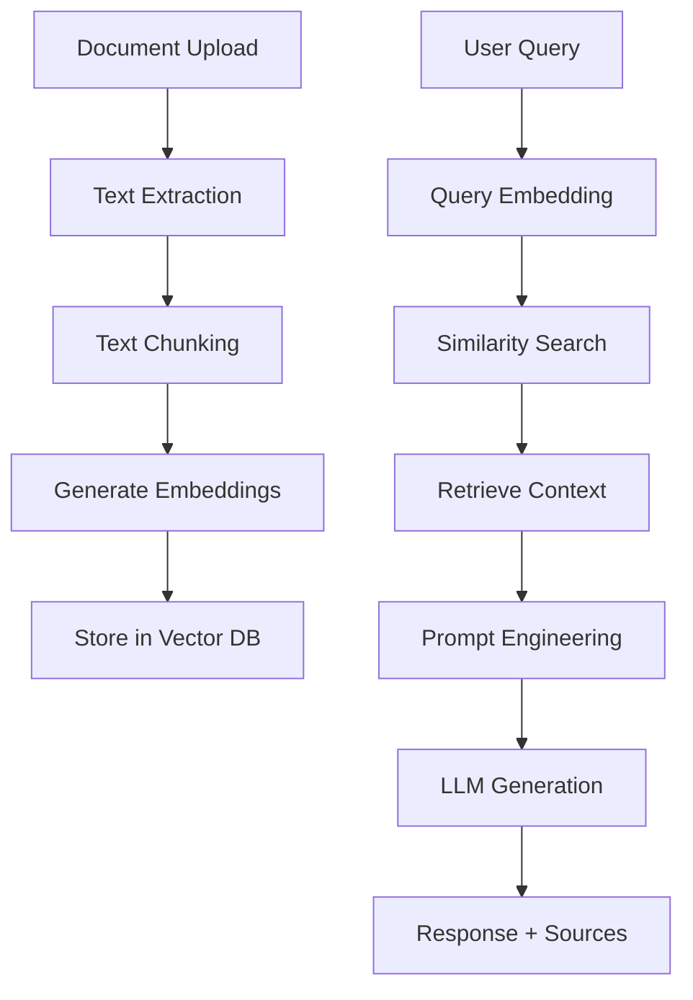

# AI-powered intelligent Q&A system leveraging embeddings, RAG, and Spring AI backend

A sophisticated, production-ready intelligent question-answering system that combines the power of modern AI technologies with enterprise-grade backend architecture. Built with Spring Boot 3.3+ and Spring AI, this system enables users to upload documents and receive contextually accurate answers through advanced Retrieval-Augmented Generation (RAG) techniques.

## 🎯 Project Overview

This system transforms static documents into an interactive knowledge base by:

- **Document Intelligence**: Automatically extracts and processes text from PDF, DOCX, and TXT files
- **Semantic Understanding**: Converts document content into high-dimensional vector embeddings using OpenAI's state-of-the-art embedding models
- **Intelligent Retrieval**: Performs semantic similarity search to find the most relevant document chunks for any query
- **Contextual Generation**: Leverages GPT-4o-mini to generate accurate, context-aware responses based on retrieved information
- **Persistent Memory**: Maintains conversation history and document relationships for enhanced user experience

## 🏗️ Technical Architecture

The system implements a complete RAG (Retrieval-Augmented Generation) pipeline:

1. **Document Processing Layer**: Handles file uploads, text extraction, and content validation
2. **Embedding Layer**: Chunks documents and generates vector embeddings for semantic search
3. **Vector Database**: Stores embeddings in PostgreSQL with pgvector for high-performance similarity search
4. **Query Processing Layer**: Implements RAG workflow with context retrieval and prompt engineering
5. **AI Integration Layer**: Seamlessly integrates with OpenAI's GPT and embedding models via Spring AI
6. **API Layer**: Provides RESTful endpoints with comprehensive documentation and error handling

## 🚀 Enterprise-Grade Capabilities

- **Multi-format Support**: Process PDF, DOCX, and plain text documents
- **Scalable Architecture**: Asynchronous processing and optimized database operations
- **Enterprise Security**: JWT authentication, role-based access control, rate limiting
- **High Performance**: Redis caching, connection pooling, optimized queries
- **Monitoring & Observability**: Prometheus metrics, Grafana dashboards, distributed tracing
- **Production Ready**: Docker containerization, CI/CD pipeline, health checks
- **Developer Experience**: Comprehensive API documentation with Swagger UI

## 🎆 Advanced Features

### 📄 Document Management
- **Multi-format Processing**: Seamless handling of PDF, DOCX, and TXT documents with robust text extraction
- **Intelligent Chunking**: Configurable text segmentation with overlap for optimal context preservation
- **Metadata Tracking**: Complete document lifecycle management with upload timestamps and file information
- **Async Processing**: Non-blocking document processing for improved user experience

### 🧠 AI & Machine Learning
- **Advanced Embeddings**: Utilizes OpenAI's text-embedding-3-small model for superior semantic understanding
- **RAG Implementation**: Complete Retrieval-Augmented Generation pipeline for contextually accurate responses
- **Similarity Search**: High-performance vector similarity search using PostgreSQL's pgvector extension
- **Prompt Engineering**: Optimized system prompts for consistent, reliable AI responses

### 📊 Data & Analytics
- **Query History**: Comprehensive conversation tracking with context document references
- **Performance Optimization**: Indexed database operations and efficient vector storage
- **Scalable Storage**: Configurable file storage with support for local and cloud storage solutions

### 🔌 Integration & APIs
- **RESTful Architecture**: Clean, well-documented API endpoints following REST principles
- **CORS Support**: Seamless frontend integration with configurable cross-origin policies
- **Swagger Documentation**: Interactive API documentation for easy testing and integration
- **Error Handling**: Comprehensive exception handling with meaningful error responses

### 🔒 Enterprise Security
- **JWT Authentication**: Stateless authentication with configurable token expiration
- **Role-Based Access Control**: User and admin roles with method-level security
- **Rate Limiting**: Token bucket algorithm to prevent API abuse
- **Input Validation**: Comprehensive request validation and sanitization
- **Security Headers**: CORS, CSRF protection, and secure defaults

### 📊 Monitoring & Operations
- **Health Checks**: Comprehensive application and dependency health monitoring
- **Metrics Collection**: Custom business metrics and performance indicators
- **Distributed Tracing**: Request tracing across service boundaries
- **Centralized Logging**: Structured logging with correlation IDs
- **Prometheus Integration**: Time-series metrics for monitoring and alerting

### 🚀 Performance & Scalability
- **Redis Caching**: Intelligent caching for frequently accessed data
- **Connection Pooling**: Optimized database connection management
- **Async Processing**: Non-blocking operations for improved throughput
- **Load Balancing Ready**: Stateless design for horizontal scaling
- **Resource Optimization**: Efficient memory and CPU usage patterns

## Prerequisites

- Java 17+
- Maven 3.6+
- PostgreSQL 14+ with pgvector extension
- Redis 7+ (for caching and rate limiting)
- OpenAI API key
- Docker & Docker Compose (for containerized deployment)

## Setup

### 1. Database Setup

```bash
# Install PostgreSQL and pgvector
brew install postgresql pgvector

# Start PostgreSQL
brew services start postgresql

# Create database
createdb knowhub

# Connect and enable pgvector
psql knowhub -c "CREATE EXTENSION vector;"
```

### 2. Environment Variables

```bash
export OPENAI_API_KEY=your-openai-api-key
export DB_USERNAME=postgres
export DB_PASSWORD=admin
export UPLOAD_DIR=./uploads
```

### 3. Build and Run

#### Development Mode
```bash
# Build the project
mvn clean install

# Run the application
mvn spring-boot:run
```

#### Production Mode with Docker
```bash
# Start all services (PostgreSQL, Redis, Monitoring)
docker-compose -f docker-compose.enterprise.yml up -d

# Build and run the application
docker build -t knowhub-backend .
docker run -p 8080:8080 --env-file .env knowhub-backend
```

The application will start on `http://localhost:8080`

#### Monitoring Dashboards
- **Grafana**: `http://localhost:3000` (admin/admin)
- **Prometheus**: `http://localhost:9090`
- **Zipkin Tracing**: `http://localhost:9411`

## API Endpoints

### Authentication
- `POST /api/auth/register` - Register a new user
- `POST /api/auth/login` - Login and get JWT token

### Document Management (Requires Authentication)
- `POST /api/documents/upload` - Upload a document
- `GET /api/documents` - Get all documents
- `DELETE /api/documents/{id}` - Delete a document

### Query & Chat (Requires Authentication)
- `POST /api/query` - Ask a question
- `GET /api/history` - Get query history

### Monitoring
- `GET /actuator/health` - Application health status
- `GET /actuator/metrics` - Application metrics
- `GET /actuator/prometheus` - Prometheus metrics endpoint

## API Documentation

Swagger UI is available at: `http://localhost:8080/swagger-ui.html`

## Testing

### 1. Register a User
```bash
curl -X POST "http://localhost:8080/api/auth/register" \
  -H "Content-Type: application/json" \
  -d '{"username": "testuser", "password": "password123"}'
```

### 2. Login and Get Token
```bash
TOKEN=$(curl -X POST "http://localhost:8080/api/auth/login" \
  -H "Content-Type: application/json" \
  -d '{"username": "testuser", "password": "password123"}' \
  | jq -r '.token')
```

### 3. Upload a Document
```bash
curl -X POST "http://localhost:8080/api/documents/upload" \
  -H "Authorization: Bearer $TOKEN" \
  -H "Content-Type: multipart/form-data" \
  -F "file=@/path/to/your/document.pdf"
```

### 4. Ask a Question
```bash
curl -X POST "http://localhost:8080/api/query" \
  -H "Authorization: Bearer $TOKEN" \
  -H "Content-Type: application/json" \
  -d '{"question": "What is the main topic of the uploaded document?"}'
```

### 5. Check Application Health
```bash
curl -X GET "http://localhost:8080/actuator/health"
```

## Configuration

Key configuration properties in `application.yml`:

```yaml
spring:
  ai:
    openai:
      api-key: ${OPENAI_API_KEY}
      chat:
        options:
          model: gpt-4o-mini
      embedding:
        options:
          model: text-embedding-3-small

knowhub:
  upload:
    directory: ./uploads
  embedding:
    chunk-size: 1000
    chunk-overlap: 200
```

## 🏗️ System Architecture

### 🔄 RAG Workflow Pipeline



### 📊 Application Layers

```
src/main/java/com/knowhub/
├── controller/          # REST API endpoints and request handling
│   ├── DocumentController   # Document upload/management APIs
│   └── QueryController      # Q&A and history APIs
├── service/            # Core business logic and AI integration
│   ├── DocumentService      # Document processing and storage
│   ├── EmbeddingService     # Vector embedding generation
│   └── QueryService         # RAG implementation and LLM integration
├── repository/         # Data access and vector operations
│   ├── DocumentRepository   # Document CRUD operations
│   ├── EmbeddingRepository  # Vector similarity search
│   └── QueryHistoryRepository # Conversation history
├── model/             # JPA entities and database schema
│   ├── Document            # Document metadata and content
│   ├── EmbeddingVector     # Vector embeddings storage
│   └── QueryHistory        # Q&A interaction history
├── dto/               # Data transfer objects for API
│   ├── QueryRequest        # User question input
│   ├── QueryResponse       # AI response with sources
│   └── DocumentResponse    # Document metadata output
├── config/            # Application configuration
│   ├── CorsConfig          # Frontend integration setup
│   └── AsyncConfig         # Background processing
└── exception/         # Error handling and validation
    ├── DocumentProcessingException
    └── GlobalExceptionHandler
```

### 🔍 Data Flow Architecture

1. **Document Ingestion**: Files are uploaded, validated, and stored with metadata
2. **Text Processing**: Content is extracted and intelligently chunked for optimal retrieval
3. **Embedding Generation**: Text chunks are converted to high-dimensional vectors using OpenAI
4. **Vector Storage**: Embeddings are stored in PostgreSQL with pgvector for similarity search
5. **Query Processing**: User questions are embedded and matched against document vectors
6. **Context Retrieval**: Most relevant document chunks are retrieved based on similarity scores
7. **Response Generation**: Retrieved context is used to generate accurate, contextual answers
8. **History Tracking**: All interactions are logged for audit and user reference

## 🛠️ Technology Stack

### 🏢 Backend Framework
- **Spring Boot 3.3+** - Modern Java application framework with auto-configuration and production-ready features
- **Spring AI** - Cutting-edge AI integration framework for seamless LLM and embedding model integration
- **Spring Data JPA** - Simplified data access layer with automatic repository implementation
- **Spring Security** - Enterprise-grade security framework (ready for authentication/authorization)

### 🧠 AI & Machine Learning
- **OpenAI GPT-4o-mini** - Advanced language model for intelligent response generation
- **OpenAI Embeddings (text-embedding-3-small)** - State-of-the-art text embeddings for semantic search
- **RAG Architecture** - Retrieval-Augmented Generation for context-aware AI responses

### 📊 Database & Storage
- **PostgreSQL 14+** - Robust relational database with advanced features
- **pgvector Extension** - High-performance vector similarity search capabilities
- **JPA/Hibernate** - Object-relational mapping with automatic schema management

### 📄 Document Processing
- **Apache PDFBox 3.0+** - Comprehensive PDF text extraction and manipulation
- **Apache POI 5.2+** - Microsoft Office document processing (DOCX, etc.)
- **Custom Text Chunking** - Intelligent document segmentation algorithms

### 🔌 API & Documentation
- **Springdoc OpenAPI 3** - Automatic API documentation generation with Swagger UI
- **Jakarta Validation** - Comprehensive input validation and error handling
- **CORS Configuration** - Flexible cross-origin resource sharing setup

### 🛠️ Development & Operations
- **Maven 3.6+** - Dependency management and build automation
- **Docker & Docker Compose** - Containerization and local development environment
- **Java 17+** - Modern Java features and performance optimizations